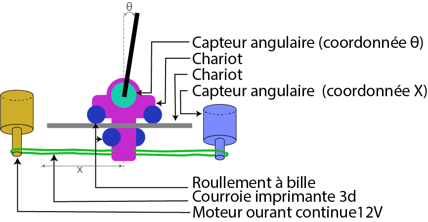

# Projet d'un pendule inverse controlé par un modèle de Reinforcement Learning

https://github.com/user-attachments/assets/65353b49-5a06-4835-9948-fa3759f57c91

## Table des Matière

- [Introduction](#introduction)

## Introduction

Ce projet se concentre sur la conception et la réalisation d'un système de contrôle pour un pendule inversé, un problème classique en robotique et en théorie du contrôle. Le défi consiste à maintenir le pendule en position verticale, un état naturellement instable, en utilisant une approche basée sur l'apprentissage par renforcement (Reinforcement Learning, RL).

L'objectif principal de ce projet est de développer une solution complète, allant de la conception mécanique et électronique du pendule, à l'entraînement d'un modèle d'IA capable de stabiliser le système, d'abord en simulation, puis sur le modèle physique réel.

Dans ce README, je vais vous guider à travers les différentes étapes de mon processus de conception du pendule, en détaillant chaque phase du projet :

1. **Conception du pendule mécanique et électronique**
2. **Détermination des caractéristiques physiques du pendule pour la simulation**
3. **Modèle de Renforcement Learning utilisé et entraînement sur la simulation**

## Conception du Pendule Mécanique et Électronique

Dans cette section, nous allons aborder la conception complète du pendule inversé. Nous commencerons par la conception mécanique. Ensuite, nous passerons à la conception électronique du pendule.

### Conception mécanique

Voici la structure mécanique du pendule. La barre rigide du pendule est fixée à un capteur angulaire qui permet une rotation libre tout en mesurant l'angle $\theta$. Ce capteur est monté sur un chariot qui peut se déplacer de manière rectiligne le long d'un axe pour maintenir la barre en équilibre. Le chariot est équipé de six roulements à billes disposés de manière à pincer un support fixe, garantissant ainsi un déplacement rectiligne sans frottement.

Pour contrôler le déplacement rectiligne, j'utilise un moteur à courant continu qui entraîne une courroie d'imprimante 3D à laquelle le chariot est attaché. Afin de mesurer la postion selon l'axe _x_ (axe de liberté du chariot), la courroie est également racordé sur un capteur angulaire qui mesure le déplacement de la courroie et en déduit la position _x_ du chariot.
