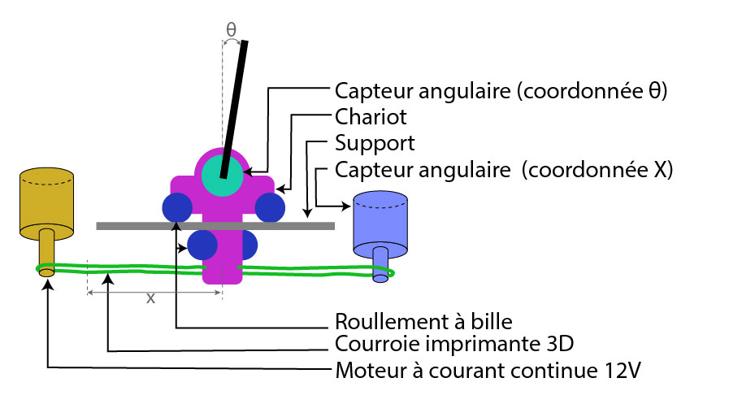

# Projet d'un pendule inverse contrôlé par un modèle de Reinforcement Learning

https://github.com/user-attachments/assets/65353b49-5a06-4835-9948-fa3759f57c91

## Table des Matière

- [Introduction](#introduction)
- [Conception Mécanique et Électronique du Pendule](#conception-mécanique-et-électronique-du-pendule)

## Introduction

Ce projet se concentre sur la conception et la réalisation d'un système de contrôle pour un pendule inversé, un problème classique en robotique et en théorie du contrôle. Le défi consiste à maintenir le pendule en position verticale, un état naturellement instable, en utilisant une approche basée sur l'apprentissage par renforcement (Reinforcement Learning, RL).

L'objectif principal de ce projet est de développer une solution complète, allant de la conception mécanique et électronique du pendule, à l'entraînement d'un modèle d'IA capable de stabiliser le système, d'abord en simulation, puis sur le modèle physique réel.

Dans ce README, je vais vous guider à travers les différentes étapes de mon processus de conception du pendule, en détaillant chaque phase du projet :

1. **Conception du pendule mécanique et électronique**
2. **Détermination des caractéristiques physiques du pendule pour la simulation**
3. **Modèle de Renforcement Learning utilisé et entraînement sur la simulation**

## Conception Mécanique et Électronique du Pendule

Dans cette section, nous allons aborder la conception complète du pendule inversé. Nous commencerons par la conception mécanique. Ensuite, nous passerons à la conception électronique du pendule. Enfin, nous examinerons le protocole de communication entre le microcontrôleur et l'ordinateur qui génère les commandes.

### Conception mécanique

Voici la structure mécanique du pendule. La barre rigide du pendule est fixée à un capteur angulaire qui permet une rotation libre tout en mesurant l'angle $\theta$. Ce capteur est monté sur un chariot qui peut se déplacer de manière rectiligne le long d'un axe pour maintenir la barre en équilibre. Le chariot est équipé de six roulements à billes disposés de manière à pincer un support fixe, garantissant ainsi un déplacement rectiligne sans frottement.

Pour contrôler le déplacement rectiligne, j'utilise un moteur à courant continu qui entraîne une courroie d'imprimante 3D à laquelle le chariot est attaché. Afin de mesurer la position selon l'axe _x_ (axe de liberté du chariot), la courroie est également raccordé sur un capteur angulaire qui mesure le déplacement de la courroie et en déduit la position _x_ du chariot.

Voici la liste des différents composants mécaniques externes du pendule :

| Nom                                 | Fonction                                      | Marque   | Lien utile                                                                                                                                                                                |
| ----------------------------------- | --------------------------------------------- | -------- | ----------------------------------------------------------------------------------------------------------------------------------------------------------------------------------------- |
| Moteur DC 12V                       | Mettre en mouvement le chariot                | ICQUANZX | [Amazon](https://www.amazon.fr/ICQUANZX-engrenages-r%C3%A9duction-%C3%A9lectrique-Diam%C3%A8tre/dp/B0824V7YGT)                                                                            |
| Encoder (400p & 1000p)              | Mesurer la position _x_ et l'angle $\theta$   | OMRON    | [Datasheet](https://assets.omron.eu/downloads/latest/datasheet/en/q085_e6b2-c_incremental_rotary_encoder_40_mm_datasheet_en.pdf)                                                          |
| Roulement à bille (625-ZZ & 635-ZZ) | Assurer le déplacement du chariot             | ROLAKIN  | [625-ZZ](https://www.123roulement.com/roulement-palier/roulement-bille/simple-rangee/625-zz) [635-ZZ](https://www.123roulement.com/roulement-palier/roulement-bille/simple-rangee/635-zz) |
| Courroie imprimante 3D              | Transmettre le mouvement du moteur au chariot | TUZUK    | [Amazon](https://www.amazon.fr/gp/product/B08SWTSG2K)                                                                                                                                     |

Ensuite, pour fabriquer les différentes pièces de mon pendule, j'ai modélisé l'ensemble du système à l'aide du logiciel **Fusion 360**. J'ai ensuite exporté les différents plans de coupe de ma modélisation et j'ai découpé mes pièces sur une plaque de plexiglas, à l'aide d'une découpeuse laser. Les pièces ont ensuite été assemblées avec des vis et d'écrous, facilitant ainsi le remplacement de composant.

J'ai opté pour un design adapté à la découpe laser plutôt que de l'impression 3D en raison de :

- La précision des découpes,
- La rapidité de fabrication,
- Le prix de la matière première.

Malheureusement, certaines pièces plus complexes ont dû être imprimées en 3D en raison de leur besoin de symétrie circulaire (l’embout entre la courroie et le moteur) ou nécessitant une épaisseur supérieur à 3mm (les pieds du support).

Je vous laisse voir le [dossier Conception](/Conception) pour avoir accès aux fichiers _Fusion 360_.

### Conception électronique

Pour contrôler le moteur du pendule inverse et collecter les données en temps réel, j'utilise un intermédiaire, une carte Arduino. Celle-ci capte les informations des capteurs et les transmet à un ordinateur via USB. Ensuite, l'Arduino reçoit les commandes de contrôle générées par le modèle et les applique pour stabiliser le pendule. Dans cette partie, nous allons étudier le schéma électrique permettant la récupération des données par les capteurs et le contrôle du moteur.

#### Capteurs

J'ai utilisé des capteurs de rotation incrémental pour suivre l'angle $\theta$ du pendule et la position X du chariot. Le fonctionnement de ces capteurs est détaillé dans cette [vidéo youtube](https://www.youtube.com/watch?v=zzHcsJDV3_o). Ces types de capteurs ont l'avantage d'avoir un coût relativement bas par rapport à la précision qu'ils proposent. Cependant, ils fournissent des mesures d'angles relatifs plutôt que des mesures absolus. Ainsi, il est nécessaire de calibrer nos capteurs à chaque démarrage de l'Arduino et d'établir une position référentiel toujours identique.

Pour calibrer l'angle $\theta$, la procédure est simple : avant d'allumer le microcontrôleur, il suffit de s'assurer que la barre est parfaitement immobile en position verticale. Ainsi j'ai un angle de référence pour $\theta$ (180°). En revanche, la détermination de la position X du chariot est plus complexe, car il est nécessaire de connaître sa position absolue sur le support. Pour résoudre ce problème, j'ai installé un bouton poussoir à l'extrémité gauche du support. Il suffit alors de déplacer le chariot vers la gauche jusqu'à ce qu'il appuie sur le bouton, indiquant que le chariot est en position de butée gauche. À partir de cette position de référence, le suivi de la coordonnée X peut être effectué.

> J'utilise une résistance dite de _pulldown_ dans le circuit afin d'éviter les faux positifs créer par le bruit autour du bouton.

#### Moteur

Pour contrôler le chariot, j'utilise un moteur 12V qui offre un couple suffisant pour stabiliser le système. Cependant, le microcontrôleur ne fournit que des commandes en 5V. Pour adapter cette commande, j'utilise un pont en H, en particulier le module L298N. Grâce à un ensemble de transistors, ce module permet de convertir une commande de 5V appliquée sur la broche ENB en une tension de 12V aux bornes du moteur. De plus, en utilisant les broches 1 et 2, il est possible de contrôler le sens de rotation du moteur. En inversant le signal envoyé à ces broches, on applique une tension de -12V au moteur, ce qui à pour effet de changer son sens de rotation.

Cependant, dans cette configuration, seules trois commandes peuvent être appliquées au moteur : -12V, 0V et 12V. Il n'est pas possible de générer une tension intermédiaire. Heureusement, la carte Arduino offre une solution à ce problème grâce à ses broches PWM (indiquées par le symbole ~). Ces broches permettent de générer un signal créneau à haute fréquence avec des largeurs de bande modulable. Ainsi, en ajustant la largeur de l'impulsion, il est possible de simuler une tension intermédiaire. Par exemple, pour obtenir une tension de 9V aux bornes du moteur, il suffit de fournir une tension de 12V pendant 75% du cycle, puis de laisser 0V pendant les 25% restants. L'inertie du moteur se charge alors de lisser ce courant, ce qui permet d'obtenir une tension effective proche de 9V, assurant ainsi un contrôle plus fin de la vitesse du chariot.

